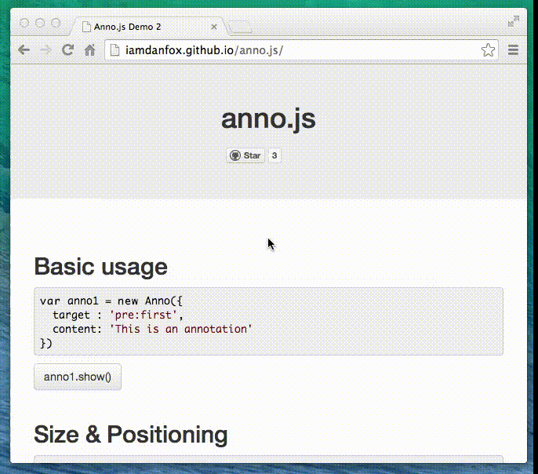

anno.js [](https://travis-ci.org/iamdanfox/anno.js)
=======

Anno.js lets you add powerful step-by-step guides to your web-apps. **[See demo!][1]**

[](http://iamdanfox.github.io/anno.js/)

**Anno.js is built to be extensible.** The source is about 500 lines of literate coffeescript; you can [read the annotated source][3] in just a few minutes!

Usage
-----

Include the following in your HTML page:

```html
<!-- get jQuery from somewhere; personally, I like the Google CDN: -->
<script src="http://ajax.googleapis.com/ajax/libs/jquery/2.0.3/jquery.min.js"></script>
```
```html
<script src="http://iamdanfox.github.io/anno.js/anno.js" type="text/javascript"></script>
<script src="http://iamdanfox.github.io/anno.js/scrollintoview/jquery.scrollintoview.min.js" type="text/javascript"></script>

<link href="http://iamdanfox.github.io/anno.js/anno.css" rel="stylesheet" type="text/css" />
```

After including `anno.js` you can define your annotations ([see examples][1]).

For better performance, you can host the files yourself. Clone the repo or [download the zip][2], then copy `anno.js`, `anno.css` and `scrollintoview/jquery.scrollintoview.min.js` into your project.


[1]: http://iamdanfox.github.io/anno.js/
[2]: https://github.com/iamdanfox/anno.js/archive/gh-pages.zip
[3]: http://iamdanfox.github.io/anno.js/docco/anno.html
